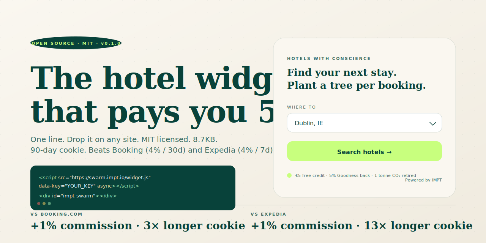

<div align="center">

# 🌱 IMPT Swarm Widget

### The open-source hotel-search widget that pays you **5%**

[](./LICENSE)
[](#bundle-size)
[](#attribution)
[](#commission)
[](./TERMS.md)
[](https://impt.io)

**One line. Drop it anywhere. 5% on every confirmed booking. A tree planted per stay.**



[**▶ Live demo**](https://swarm.impt.io/widget) · [Get a partner key](https://swarm.impt.io/widget#signup) · [Docs](./docs/integration.md) · [Why](#why-this-exists)

</div>

---

```html
<script src="https://swarm.impt.io/widget.js" data-key="YOUR_KEY" async></script>
<div id="impt-swarm"></div>
```

That's it. Renders a cream-skin search box. Your visitors find hotels. You earn 5%. Carbon offset (1 tonne per stay) and 5% Goodness loyalty back to your guest are paid by IMPT, not deducted from you.

---

## How we compare

| | **IMPT Swarm** | Booking.com | Expedia |
|---|:-:|:-:|:-:|
| Commission | **5%** ✓ | 4% | 4% |
| Cookie window | **90 days** ✓ | 30 days | 7 days |
| Open-source (MIT) | **Yes** ✓ | – | – |
| Carbon offset / booking | **1 tonne** ✓ | – | – |
| Loyalty back to guest | **5% Goodness** ✓ | – | – |
| Setup time | **60 sec** ✓ | days | days |
| Approval | **Automated** ✓ | manual | manual |
| Setup fee / minimums | **€0** ✓ | – | – |

---

## Why this exists

Booking.com pays affiliates 4%. Expedia pays 4%. Both are closed black-boxes — you trust their pixel, hope their attribution holds, get paid whatever they decide.

We're building IMPT — the hotel platform that offsets a tonne of carbon per booking and gives 5% back to your guest as Goodness loyalty (3% to a cause they choose, 2% to their next stay). And we wanted the world to embed our search.

So we open-sourced our widget. **5% to you, MIT licence, no rules.**

If you run a hotel, a travel blog, a country guide, an ESG platform, or a personal site that mentions hotels even once — you can drop this in and start earning.

## What you get

- **5% commission** on every confirmed, checked-in booking. Paid monthly via Wise / PayPal / Stripe / IMPT card / IMPT token.
- **90-day attribution cookie.** Better than Booking.com (30 days) and Expedia (7 days).
- **A tree planted per booking** in *your* name (you choose the cause).
- **Real-time dashboard** at [partners.impt.io/widget](https://partners.impt.io/widget).
- **Zero cost.** No setup fees. No minimums. No traffic requirements. No sales call.

## How it works

1. [Get a partner key](https://swarm.impt.io/widget#signup) (email + payout method, ~30 seconds, no card).
2. Drop the snippet on your page.
3. Guest searches → lands on `app.impt.io` → books a hotel.
4. You earn 5% of the base booking value.
5. Monthly payout once your balance crosses €50.

## Install

<details open>
<summary><b>One-line embed (any site)</b></summary>

```html
<script src="https://swarm.impt.io/widget.js" data-key="YOUR_KEY" async></script>
<div id="impt-swarm"></div>
```
</details>

<details>
<summary><b>npm / Vite / Next.js</b></summary>

```bash
npm i @impt/swarm-widget
```

```ts
import { mountSwarm } from '@impt/swarm-widget'
mountSwarm('#impt-swarm', { key: 'YOUR_KEY' })
```
</details>

<details>
<summary><b>React</b></summary>

```tsx
import { ImptSwarm } from '@impt/swarm-widget/react'

export default function Page() {
  return <ImptSwarm partnerKey="YOUR_KEY" dest="Dublin" />
}
```
</details>

<details>
<summary><b>WordPress</b></summary>

```
[impt-swarm key="YOUR_KEY"]
```
</details>

<details>
<summary><b>Shopify</b></summary>

Drop the `swarm-widget.liquid` block into your theme. PR for native app coming.
</details>

## Configuration

| Attribute | Default | Description |
|---|---|---|
| `data-key` | required | Your partner key from [partners.impt.io](https://partners.impt.io/widget) |
| `data-cause` | `trees` | `trees` / `ocean` / `bronagh` / `custom` |
| `data-theme` | `cream` | `cream` / `dark` / `auto` |
| `data-dest` | none | Optional pre-fill destination, e.g. `Dublin` |
| `data-currency` | auto | `EUR` / `USD` / `GBP` — defaults to destination currency |
| `data-lang` | `en` | Reserved for i18n PRs |

## Attribution

- **Last-touch wins.** Most recent partner cookie gets paid.
- **90-day cookie.** Set on `*.impt.io` first-party. No tracking on your domain.
- **Cross-device** — carries on the user record once they sign in.
- **Cancellations reverse** automatically. You get paid for confirmed, non-refundable, checked-in bookings.

Full attribution model: [docs/attribution.md](./docs/attribution.md).

## Commission

Read the [commission docs](./docs/commission.md) for exact numbers, payout cadence, anti-fraud measures, and edge cases. Short version:

- 5% of **base booking value** (room rate × nights × rooms; excludes taxes/fees).
- Paid monthly on the 5th, threshold €50, refund window 30 days from check-in.
- Methods: Wise / PayPal / Stripe / IMPT card / IMPT token (small bonus).

## Bundle size

We're allergic to widget bloat. Every release is checked against a **12KB gzipped** budget. CI fails the build if it goes over. Currently: **8,761 bytes (8.7KB)**.

## Privacy

- No third-party trackers fired from the widget.
- No cookies set on your domain — only first-party `*.impt.io`.
- Open-source: read every line of [`src/`](./src) yourself.
- IPs and User-Agents are SHA-256-hashed before storage. No raw retention.
- Full notice: [PRIVACY.md](./PRIVACY.md).

## Roadmap

**Shipped (v0.1.0):** widget bundle, demo, signup, email-verify gate, HMAC webhook, rate-limited public API, ToS, MIT.

**Next (v0.2):**
- Vue + Svelte + Astro + Solid wrappers
- WordPress + Shopify native plugins
- Partner dashboard UI at `partners.impt.io/widget`
- Automated payouts (Wise/PayPal/Stripe API)
- TypeScript types + tests
- White-label theme presets
- Apple/Google Wallet booking pass
- Push notifications (price-drop alerts)

## Contributing

PRs welcome. See [CONTRIBUTING.md](./CONTRIBUTING.md).

We use [DCO](https://developercertificate.org/) — sign your commits with `git commit -s`. No CLA, no DocuSign, no friction.

Wishlist:
- WordPress / Shopify / Wix native plugins
- i18n (we ship in English; community = the world)
- Vue / Svelte / Astro component wrappers
- Theme presets
- Tests

## Licence

**MIT.** Use it for anything. Even competitors. *(We're confident.)*

## Legal + security

- [Partner Terms](./TERMS.md) — commission, payout, what you must not do.
- [Privacy notice](./PRIVACY.md) — what data we collect, why, retention.
- [Security policy](./SECURITY.md) — vulnerability reporting, 90-day disclosure.

## About IMPT

[IMPT](https://impt.io) is a hotel booking + carbon offset platform. 195 countries. 1.7M hotel URLs. €5 free signup credit. 5% Goodness loyalty back per booking — 3% to a cause, 2% to your next stay. Building the world's first AI hotel system.

This widget is part of how we get there.

— Mike, Henry, AJ, Julia, San, Harshal & the IMPT team

---

<div align="center">

🌱 *Hotels with conscience. Now embeddable everywhere.*

[Live demo](https://swarm.impt.io/widget) · [Get a partner key](https://swarm.impt.io/widget#signup) · [Twitter](https://x.com/IMPT_token) · [impt.io](https://impt.io)

</div>
